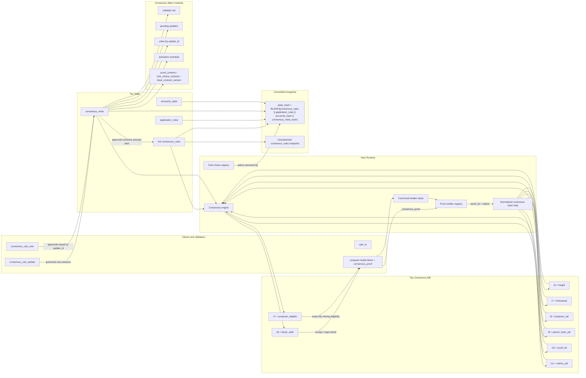
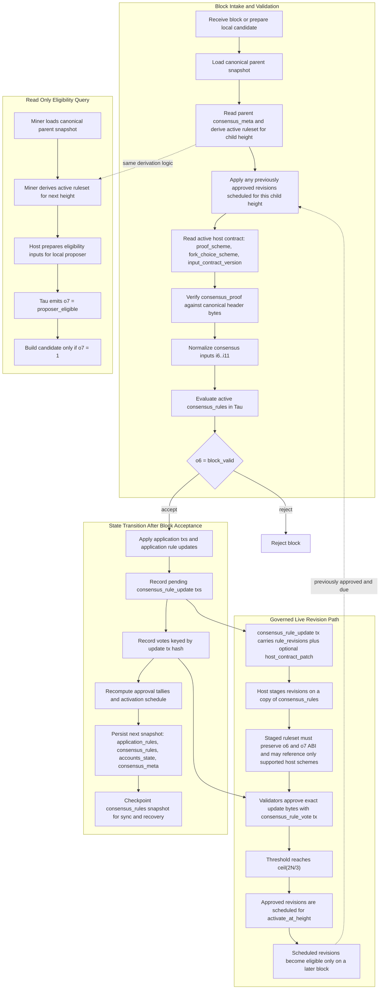

# Tau Testnet Consensus Architecture

## Goals
- Move consensus policy out of Python-owned control and into a governed Tau state machine so the active mechanism can evolve by revising Tau rules instead of rewriting host consensus code.
- Keep the host responsible for deterministic header encoding, persistence, networking, proof verification, and orchestration while Tau decides proposer eligibility, block validity, and consensus-state transitions.
- Ensure mining, block import, replay, and reorg all evaluate consensus through the same parent-state snapshot and the same engine contract.
- Deliver a practical v1 that replaces the current Python-owned PoA flow with a Tau-driven PoA flow first, while keeping the architecture open to PoS and other mechanisms later.
- Launch the new model on a fresh testnet reset with a clean protocol-version boundary instead of carrying the current block and wire constraints forward.

## Non-Goals
- v1 does not implement Tau-native cryptographic verification. BLS, VRF, and VDF proofs remain host-verified.
- v1 does not implement PoS, epoch machinery, finality gadgets, or stake-weighted proposer selection.
- v1 does not preserve backward compatibility with the current block format, network protocol version, or handshake format.
- v1 does not allow ordinary application rule updates to rewrite consensus immediately or implicitly.
- v1 does not treat consensus evolution as one-shot bundle replacement. The architecture is built around live governed rule state instead.

## Current-State Constraints
The current codebase already establishes the boundaries that the new design must replace rather than stretch:

- Consensus enforcement is still Python-owned in [`poa/engine.py`](../poa/engine.py). `PoATauEngine.verify_block()` computes the expected round-robin validator from block height and verifies the block signature against that validator directly in the host.
- Mining still uses Python turn checks in [`commands/createblock.py`](../commands/createblock.py) and [`miner/service.py`](../miner/service.py). `create_block_from_mempool()` and `SoleMiner._should_mine()` both decide whether the local node may propose the next block without consulting Tau.
- Replay and import also depend on the same Python verifier. [`chain_state.py`](../chain_state.py) calls `PoATauEngine.verify_block()` during canonical replay and block ingestion, so consensus is not centralized behind a mechanism-neutral interface yet.
- Tau input streams are already partially reserved. [`tau_defs.py`](../tau_defs.py) reserves `i0..i5`, and `i5` is already used as a node-injected consensus timestamp during block execution. `i2` therefore cannot be repurposed for block metadata because it already carries transfer-balance semantics.
- The checked-in [`genesis.tau`](../genesis.tau) is not a consensus program. It currently provides only a minimal bootstrap for pointwise revision via `i0`; it does not define proposer selection, block validity, governance, or a stable consensus ABI.
- The current committed state hash only binds rules plus account state. [`poa/state.py`](../poa/state.py) computes `BLAKE3(rules_bytes || accounts_hash)`, which is insufficient once validator approvals, staged revisions, and activation timing become consensus-critical state.

These constraints are the reason the architecture must be inverted instead of incrementally stretching the current PoA-specific flow.

## Architectural Principles
- **Host/Tau separation**: the host owns serialization, storage, networking, and cryptographic proof verification; Tau owns policy, eligibility, and consensus-state evolution.
- **Consensus is live state**: proposer schedules, approvals, pending revisions, and activation timing are committed consensus state, not transient runtime config.
- **One engine contract**: mining, import, replay, and reorg must all ask the same engine the same question against the same parent snapshot.
- **Parent-state validation**: a block is always validated against the consensus state active at its parent. State changes carried by a block can only affect later blocks.
- **Separate governance domains**: ordinary application rules and consensus rules are different state domains with different admission and authorization rules.
- **Stable host boundary**: Tau may revise consensus policy inside a fixed host contract, but it cannot invent new proof verifiers or fork-choice algorithms at runtime.

## Target Model
The target architecture splits the node into a generic host runtime and a Tau-governed consensus layer built around live rule revision.

### Host Layer Responsibilities
- Define canonical block and transaction encodings.
- Verify `consensus_proof` according to the active `proof_scheme`.
- Normalize verifier output into deterministic Tau inputs.
- Persist blocks, accounts, consensus metadata, and checkpointed Tau rule snapshots.
- Drive sync, import, replay, and reorg using one common consensus engine.
- Dispatch fork choice through a registered `fork_choice_scheme`.
- Validate that proposed consensus rule revisions preserve the consensus ABI and reference only host capabilities the node already supports.

### Tau Layer Responsibilities
- Determine whether a proposer is eligible for a given parent snapshot and height.
- Determine whether a block is valid under the active consensus policy.
- Evolve the live consensus ruleset when approved revisions activate.
- Evolve governance state associated with pending revisions, approvals, and activation scheduling.
- Keep mechanism-specific policy in governed Tau source instead of Python `if/else` branches.

### Consensus Engine Contract
The host should converge on one mechanism-neutral contract:

- `derive_active_consensus(parent_snapshot, target_height) -> active_consensus_view`
- `verify_block_header(active_consensus_view, block, proof_result) -> verdict`
- `apply_block(active_consensus_view, block) -> next_snapshot`
- `query_eligibility(active_consensus_view, local_pubkey, target_height, now_ts) -> eligible`

`derive_active_consensus()` is important. It takes the parent snapshot and deterministically applies any previously approved revisions scheduled for the child height before the child block is evaluated.

### Live Consensus Rules, Not One-Shot Bundles
Consensus is not modeled as swapping monolithic bundles. The authoritative object is a live governed `consensus_rules` namespace that changes over time through approved Tau rule revisions.

Snapshots of `consensus_rules` still exist, but only as operational artifacts for:
- checkpointing
- sync
- replay acceleration
- auditability

They are not the governance primitive. The governance primitive is a revision batch submitted on-chain and applied pointwise to the live consensus ruleset at a future height.

### Broad Team Overview


### Detailed Validation and Governance Flow


## Consensus State Model
The new model persists four distinct state domains:

1. `application_rules`
   - User-facing Tau rules that constrain application behavior such as transfers and user policy.
   - Governed by the existing application-rule path, but constrained so they cannot reference consensus-reserved streams or outputs.

2. `consensus_rules`
   - The live governed Tau consensus namespace that implements the consensus ABI.
   - Updated only by approved `consensus_rule_update` transactions.
   - Stored as exact source text after all currently active revisions have been applied.

3. `accounts_state`
   - Canonical balances and sequence numbers, equivalent to the current account view.

4. `consensus_meta`
   - Current host contract: `proof_scheme`, `fork_choice_scheme`, `input_contract_version`.
   - Active validator set.
   - Pending rule-revision updates.
   - Vote records keyed by update id.
   - Activation schedule for approved updates.
   - Checkpoint metadata for consensus-rule snapshots.
   - Mechanism-specific metadata needed by the active consensus ruleset.

`consensus_meta` is not optional bookkeeping. It is consensus state and must be persisted and hashed exactly like balances and rules.

### Checkpoints and Snapshots
Nodes may periodically checkpoint the full serialized `consensus_rules` state for sync and recovery. Those checkpoints are:
- derived from live state
- deterministic
- replaceable by replay
- not the unit of governance

The architecture therefore distinguishes:
- **live rule state**: authoritative
- **approved revisions**: governance inputs
- **snapshots/checkpoints**: operational artifacts

## State Commitment
The committed state hash becomes:

```text
state_hash = BLAKE3(consensus_rules || application_rules || accounts_hash || consensus_meta_hash)
```

Where:
- `consensus_rules` is the exact serialized live consensus-rule state after applying all revisions active for the post-block snapshot.
- `application_rules` is the exact serialized live application-rule state.
- `accounts_hash` is the canonical hash of balances plus sequence numbers.
- `consensus_meta_hash` is the canonical hash of the current host contract, validator set, pending revision updates, recorded votes, activation schedule, checkpoint references, and other consensus-critical metadata.

This is a deliberate change from the current `rules + accounts` commitment. Once consensus becomes dynamic, a block must commit to more than balances and generic rules text. A change to any of the following must change `state_hash`:
- validator set membership
- vote totals for an update
- queued but not yet active revisions
- future activation schedule
- active host contract fields
- mechanism-specific metadata used to evaluate the next block

If staged revisions or vote state are omitted from the commitment, replay can diverge while still appearing to match the old state-hash model. The new formula closes that gap.

## Tau Consensus ABI
The live consensus ruleset must obey a stable ABI so the host can remain mechanism-neutral while Tau policy continues to evolve.

### Reserved Tau Stream Ranges
| Range | Namespace | Owner | Purpose |
| --- | --- | --- | --- |
| `i0` | Input | System | Application rule update bootstrap |
| `i1..i4` | Input | System | Existing transfer validation inputs |
| `i5` | Input | System | Node-injected block timestamp / consensus time |
| `i6..i11` | Input | System | Consensus header evaluation inputs |
| `i12+` | Input | User/application | Custom application inputs |
| `o0` | Output | System | Rule update acknowledgement / general evaluation |
| `o1` | Output | System | Transfer validation result |
| `o5` | Output | User/application | User policy decision |
| `o6` | Output | System | Consensus block validity |
| `o7` | Output | System | Proposer eligibility |

This is why `i2` cannot be reused for block metadata. It is already part of the live transfer-validation contract.

### v1 Consensus Inputs
The host must populate the following consensus inputs before evaluating block validity:

- `i6 = height`
- `i7 = timestamp`
- `i8 = proposer_yid`
- `i9 = parent_hash_yid`
- `i10 = proof_ok`
- `i11 = claims_yid`

Notes:
- `proposer_yid`, `parent_hash_yid`, and `claims_yid` are `tau_strings` ids over canonical strings or canonical JSON.
- `proof_ok` is `1` when the host verifier accepts the proof for the active `proof_scheme`, otherwise `0`.
- `claims_yid` identifies a canonical JSON object containing verifier-normalized claims. It is reserved for richer schemes and future ABI revisions; the initial Tau PoA ruleset primarily depends on `proof_ok` and `proposer_yid`.

### Required Outputs
The live consensus ruleset must emit:

- `o6 = block_valid`
- `o7 = proposer_eligible`

Interpretation in v1:
- `o6 = 1` means the block is valid under the active consensus policy.
- `o6 = 0` means reject the block.
- `o7 = 1` means the proposer is eligible for the queried parent snapshot and target height.
- `o7 = 0` means not eligible.

### ABI Stability Requirement
Any `consensus_rule_update` that would leave the ruleset unable to compile, unable to emit `o6` and `o7`, or able to shadow reserved consensus streams must be rejected during governance admission.

The current `genesis.tau` does not satisfy this ABI. The new architecture introduces a real consensus ABI and a separate live consensus namespace to implement it.

## Block Format v2
The block format changes to carry generic consensus metadata rather than a PoA-specific signature field.

### Header Fields
The canonical header retains the current fields and adds:
- `proposer_pubkey`

The canonical header therefore contains:
- `block_number`
- `previous_hash`
- `timestamp`
- `merkle_root`
- `state_hash`
- `state_locator`
- `proposer_pubkey`

`proposer_pubkey` is part of the canonical header bytes and therefore part of the block hash.

### Top-Level Consensus Proof
The top-level proof field becomes:
- `consensus_proof`

`consensus_proof` replaces `block_signature`. It is not part of the hashed header; instead, it is validated against the canonical header bytes according to the active `proof_scheme`.

In v1, the only shipped proof scheme is:
- `bls_header_sig`

Future mechanisms may introduce other proof schemes, but only if the host already implements and registers them.

## Transaction Types
The transaction envelope becomes typed so consensus governance is expressed directly as live rule revision rather than hidden inside ordinary application-rule updates.

| `tx_type` | Purpose | Core Fields |
| --- | --- | --- |
| `user_tx` | Normal application transaction | existing sender, sequence, expiration, `operations`, fee, signature |
| `consensus_rule_update` | Propose one or more consensus rule revisions | sender, sequence, expiration, `rule_revisions`, `activate_at_height`, optional `host_contract_patch`, signature |
| `consensus_rule_vote` | Approve an exact rule-update batch | sender, sequence, expiration, `update_id`, `approve`, signature |

### `user_tx`
- Keeps the current envelope and `operations` map.
- Continues to drive application rules and transfers.
- Cannot use consensus-reserved inputs or outputs.

### `consensus_rule_update`
Carries:

```json
{
  "tx_type": "consensus_rule_update",
  "rule_revisions": [
    "always (...) .",
    "always (...) ."
  ],
  "activate_at_height": 123,
  "host_contract_patch": {
    "proof_scheme": "bls_header_sig",
    "fork_choice_scheme": "height_then_hash",
    "input_contract_version": 1
  }
}
```

Semantics:
- `rule_revisions` is an ordered batch of Tau revisions to apply pointwise to the live `consensus_rules` namespace.
- `activate_at_height` is mandatory and must be strictly in the future.
- `host_contract_patch` is optional. Most rule updates will change only Tau policy and leave the host contract unchanged.
- If present, `host_contract_patch` may reference only host capabilities the node already supports.

### `consensus_rule_vote`
Carries:

```json
{
  "tx_type": "consensus_rule_vote",
  "update_id": "<consensus_rule_update_tx_hash>",
  "approve": true
}
```

`update_id` is the update transaction hash. Each validator may cast at most one approval vote per update.

## Governance Model
Consensus rewrites are not ordinary `operations["0"]` updates. They are a separate governance pathway with separate persistence, validation, and activation rules.

### v1 Approval Rules
- Only members of the active validator set may submit `consensus_rule_update` transactions.
- Only members of the active validator set may submit `consensus_rule_vote` transactions.
- Each validator may cast at most one vote per update id.
- The approval threshold is `ceil(2N/3)` of the active validator set.
- The update id is the `consensus_rule_update` transaction hash.
- An update may carry a batch of related rule revisions so the changes become active atomically.

### Admission Checks
Before an update enters governed pending state, the host must:
- stage the proposed `rule_revisions` on a copy of the current live `consensus_rules`
- verify that the staged ruleset still satisfies the consensus ABI
- reject any reference to unsupported `proof_scheme`, `fork_choice_scheme`, or `input_contract_version`
- reject any attempt to shadow reserved consensus streams or outputs

### Governance Separation
- `application_rules` remain separately updatable through the application-rule path.
- `consensus_rules` may change only through approved `consensus_rule_update` transactions.
- Checkpoint snapshots of `consensus_rules` are derived artifacts, not proposal objects.

This separation is intentional. It prevents ordinary application logic from silently redefining the block-validation contract and keeps consensus governance revision-centric instead of bundle-centric.

## Activation Semantics
Activation semantics are consensus-critical and must be fixed explicitly.

### Timing Rule
- Block `N` is validated using the consensus state derived from block `N-1`.
- That derivation includes any previously approved revisions whose `activate_at_height` equals `N`.
- If block `N` itself contains a `consensus_rule_update` or `consensus_rule_vote`, those transactions update pending governance state only.
- Revisions first recorded or approved in block `N` can affect only heights greater than `N`.

### Minimum Delay Rule
For v1:

```text
activate_at_height >= current_height + len(active_validators)
```

This guarantees at least one full current validator round between update admission and the earliest activation height.

### Same-Block Self-Validation Is Forbidden
A consensus rule update carried inside a block cannot participate in validating that same block. The validator must first decide whether the block is valid under the parent-derived active ruleset, then apply the block's governance effects to future state. This rule is required for deterministic replay and to prevent circular self-authorization.

### Activation Operation
When a target height is reached:
- the host loads the parent snapshot
- applies all due approved `rule_revisions` in deterministic order to a staging copy of `consensus_rules`
- applies any due `host_contract_patch`
- treats the resulting ruleset and host contract as the active consensus view for the child block

This is how Tau's live revision model is reflected in the architecture. Consensus evolves through active pointwise revision of a single governed ruleset, not by swapping monolithic replacement bundles.

## Proof Verification Boundary
Host-side proof verification is an intentional architectural boundary, not a temporary hack.

### Host Responsibilities
- Select the verifier using the active `consensus_meta.proof_scheme`.
- Validate `consensus_proof` against canonical header bytes.
- Produce deterministic normalized claims.
- Set `proof_ok` and `claims_yid` for Tau evaluation.
- Reject updates that patch the host contract to an unsupported proof scheme.

### Tau Responsibilities
- Decide whether a block with those normalized proof results is valid under the active policy.
- Decide whether the proposer is eligible for the queried parent snapshot and target height.
- Evolve consensus state based on governed rule updates and votes.

### Verifier Registry
The host exposes a verifier registry keyed by `proof_scheme`. In v1 the registry contains:
- `bls_header_sig`

Verifier behavior in v1:
- If the scheme is known and the proof parses, the host evaluates it and passes `proof_ok` to Tau.
- If the scheme is unknown or the proof payload is malformed beyond normalization, the host rejects before Tau evaluation.

This keeps policy in Tau while avoiding a requirement for Tau runtime cryptographic extensions.

## Fork Choice Boundary
Fork choice remains a host concern in v1, but it moves behind a registry boundary so later mechanisms can swap it cleanly.

### v1 Fork Choice
- The v1 scheme is `height_then_hash`.
- This preserves the current behavior of preferring the longest chain and using deterministic hash tie-breaking.

### Fork-Choice Registry
The host exposes a registry keyed by `fork_choice_scheme`.
- The active value lives in `consensus_meta`.
- `consensus_rule_update` transactions may patch it only to a scheme the host already supports.
- A patch that references an unsupported fork-choice scheme is rejected during update admission.

This allows Tau policy to evolve while keeping host-only algorithms explicit and reviewable.

## Processing Flows
Every validation path must use the same consensus engine and the same parent-snapshot semantics.

### Mining / Proposal Eligibility Query
1. Load the current canonical parent snapshot.
2. Derive the active consensus view for the next height by applying any due approved revisions.
3. Determine the candidate timestamp and local proposer identity.
4. Call `query_eligibility(active_consensus_view, local_pubkey, next_height, now_ts)`.
5. Produce a block only if Tau reports `o7 = proposer_eligible = 1`.
6. Build the header, compute `consensus_proof`, then submit the candidate through the same header-verification path used for imported blocks.

Mining must stop using Python round-robin logic directly.

### Block Import
1. Parse the block and canonical header.
2. Load the canonical parent snapshot.
3. Derive the active consensus view for the child height by applying any due approved revisions from the parent snapshot.
4. Verify `consensus_proof` using the active host verifier.
5. Normalize consensus inputs and evaluate the active live `consensus_rules` against the parent-derived active view.
6. Reject unless `o6 = block_valid = 1`.
7. Apply the block body, including application transactions and governed consensus transactions.
8. Persist block and post-state atomically.

### Replay / State Reconstruction
1. Start from genesis state for the new testnet.
2. For each canonical block, load the parent snapshot.
3. Derive the active consensus view for that height exactly as import would.
4. Re-run proof verification and Tau consensus evaluation exactly as import would.
5. Apply governance and application state changes only after the block has been accepted.
6. Recompute and verify the committed `state_hash`.

Replay must not bypass consensus checks or use special-case trusted-block logic.

### Reorg
1. Select the winning tip using the active host fork-choice registry.
2. Walk back to the common ancestor.
3. Rebuild forward using the same parent-derivation, proof-verification, and Tau-evaluation path as import and replay.
4. Restore mempool transactions from the abandoned branch as needed.

Reorg correctness depends on staged revisions, votes, and activation schedule being part of committed state; otherwise the active ruleset can diverge silently across branches.

## Network and Protocol Impact
This architecture is a breaking protocol version.

### Required Wire Changes
- Header sync must carry `proposer_pubkey`.
- Full block fetch and gossip must carry `consensus_proof`.
- Full block bodies must carry the new consensus transaction types.
- Handshake versioning must separate old and new nodes cleanly.
- A fresh network id and genesis are required for the reset.

### Compatibility Position
- Mixed-version nodes are unsupported.
- Old blocks are not interpreted under the new block contract.
- Old PoA-specific `block_signature` semantics do not coexist with `consensus_proof` in v1.

This is a deliberate clean break so the new consensus model is not constrained by the old PoA wire contract.

## Security and Failure Modes
| Failure Mode | Expected Behavior |
| --- | --- |
| Invalid proof under a known `proof_scheme` | Host sets `proof_ok = 0`, Tau rejects via `o6 = 0`, block is dropped |
| Unknown `proof_scheme` | Host rejects before Tau evaluation |
| Malformed `consensus_proof` that cannot be normalized | Host rejects before Tau evaluation |
| Valid proof but Tau rejects proposer or policy | Block is rejected even though cryptography passed |
| `consensus_rule_update` has malformed or too-early `activate_at_height` | Update transaction is rejected during application |
| `consensus_rule_update` would break the ABI or shadow reserved streams | Update transaction is rejected during admission |
| `consensus_rule_update` references unsupported `proof_scheme` or `fork_choice_scheme` | Update transaction is rejected during admission |
| Application rule attempts to shadow consensus streams or outputs | Transaction is rejected as invalid |
| Replay omits `consensus_meta` from the state commitment | Replay is considered invalid; implementation bug |
| Revision scheduled in the containing block attempts to affect that same block | Rejected by activation semantics |
| Host/Tau disagreement across mining, import, and replay paths | Implementation bug; release blocker |

The host and Tau have different responsibilities, but neither is optional. A cryptographically valid proof does not make a block valid if Tau rejects it, and a Tau-eligible proposer does not make a block valid if the proof fails.

## V1 Scope
### Included
- Tau-driven PoA as the first production mechanism.
- Governed live consensus-rule updates through `consensus_rule_update` and `consensus_rule_vote` transactions.
- Consensus/application rule separation.
- Proof verifier registry with `bls_header_sig`.
- Fork-choice registry with `height_then_hash`.
- Fresh testnet reset with new genesis and protocol version.

### Deferred
- Tau-driven PoS.
- Epoch transitions and epoch-based governance windows.
- VRF-backed or VDF-backed proposer selection.
- Finality gadgets and checkpointing beyond basic operational snapshots.
- Dynamic host plugin download or runtime installation of unknown proof or fork-choice schemes.

## Implementation Roadmap
1. **Phase 1: block, transaction, and state interfaces**
   - Introduce block format v2, typed governance transactions, split rule domains, and committed `consensus_meta`.
2. **Phase 2: generic consensus engine**
   - Replace PoA-specific verification with a mechanism-neutral engine plus verifier and fork-choice registries.
3. **Phase 3: bootstrap Tau PoA ruleset and revision governance**
   - Add the first live consensus ruleset, `consensus_rule_update` and `consensus_rule_vote` handling, staging checks, and activation scheduling.
4. **Phase 4: unify all processing paths**
   - Route mining, import, replay, sync ingestion, and reorg through the same parent-derivation and Tau-evaluation contract.
5. **Phase 5: launch fresh testnet**
   - Publish new genesis, network id, protocol version, and operational guidance.

This roadmap is intentionally short. The document defines the end-state architecture; the implementation plan should derive from it rather than the other way around.

## Acceptance Criteria
The architecture is implemented correctly only when all of the following are true:

- No Python round-robin logic remains in block-validity decisions.
- Mining, import, replay, and reorg all reach the same verdict for the same block and parent snapshot.
- Consensus rewrites happen through governed live rule revisions, not through implicit application-rule updates or Python config changes.
- Consensus updates require governed approval and future activation.
- Consensus metadata changes modify the committed `state_hash`.
- Application-rule updates and consensus-rule updates are distinct governance domains.
- Old and new protocol versions are cleanly separated at the network boundary.
- The active consensus ruleset can evolve through approved on-chain revisions without introducing a new Python consensus engine.

## Future Extensions
This architecture is designed to accommodate later mechanisms without changing the host/Tau boundary:

- A Tau-driven PoS mechanism can be introduced by revising the live consensus ruleset and extending consensus metadata, rather than by creating a new Python engine.
- A new proof system can be added by registering a new host verifier and allowing governed updates to patch `proof_scheme` to that supported value.
- A new fork-choice rule can be added by registering a new host fork-choice implementation and allowing governed updates to patch `fork_choice_scheme`.
- More complex leader-election logic, including VRF or VDF claims, can be added by extending normalized verifier claims and consensus metadata without collapsing back to Python-owned policy.
- More aggressive snapshotting, compaction, or state-distribution strategies can be added later without changing the fact that the authoritative consensus object is the live governed ruleset.

The critical invariant is that Tau continues to own policy through live governed revision, while the host continues to own proof execution, data transport, and deterministic orchestration.
